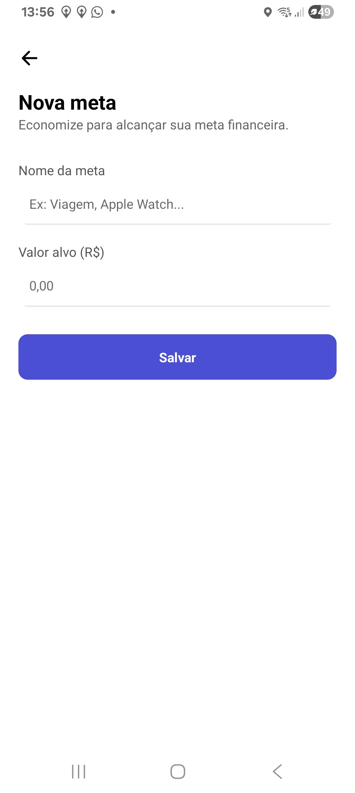
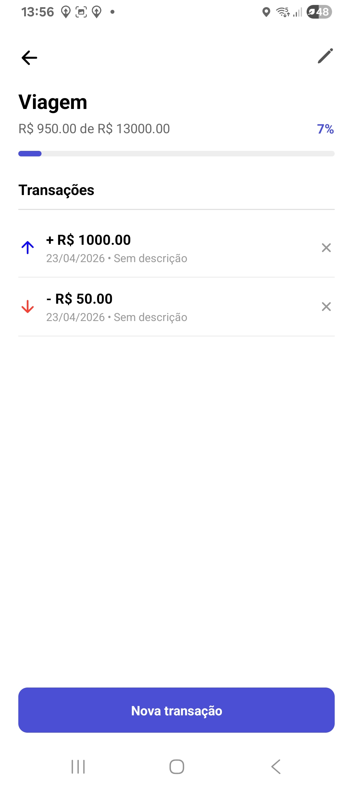
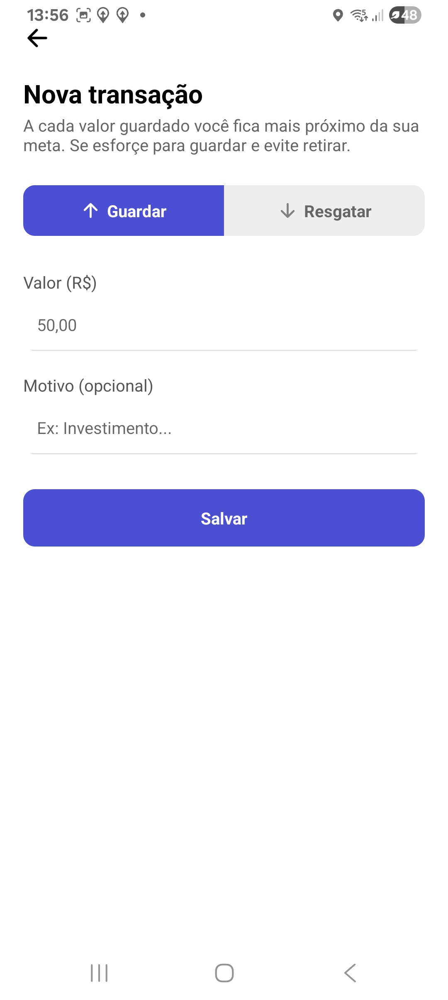
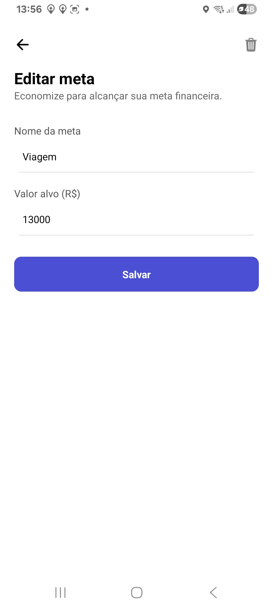

# Sistema de Refeição

Target Financiero criado para a matéria de Sistemas Móveis do Unileste, curso de Sistemas da Informação, 01/26

## Objetivo:

O objetivo desse aplicativo é ajudar o usuário a definir, acompanhar e alcançar metas financeiras de forma simples e visual, permitindo registrar valores guardados ou resgatados, visualizar o progresso em relação ao objetivo e acompanhar o histórico de transações, tornando o planejamento financeiro mais organizado, motivador e fácil de controlar no dia a dia.

## Tecnologias usadas:

Foram usadas as seguintes tecnologias e ferramentas na criação desse aplicativo:
- React Native
- Expo
- Expo Go
- React Navigation
- Typescript
- Expo Vector

## Screenshots:

||||||
|---|---|---|---|---|


## Modo de uso:

Abra o terminal e execute o seguinte código para clonar o repositorio:
```
git clone https://github.com/Neves004/target-financeiro.git
```

Depois, entre na pasta usando o comando:
```
cd target-financeiro
```

Depois, instale as dependências:
```
npm install
```

Depois, certifique-se de ter instalado o Expo Go no seu celular.

Após isso, pode executar o aplicativo, usando o comando:
```
npm run start
```
